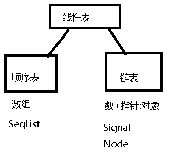
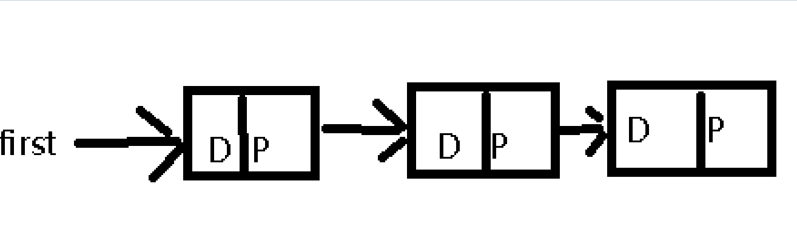

# 实验一------顺序表和链表

首先，实验的总体思路是创建一个线性表的基类

线性表应该有以下的一些功能:

* 增加元素
* 删除元素
* 替换元素
* 寻找元素

线性表的属性应该有

* 表的容量
* 表的成员个数

由于最终表的形式不确定，所以，不需要定义指针或者数组

这个类是一个纯虚的模板类

```cpp
#include <iostream>
using namespace std;
template <class T>
class LinearList
{
public:
	virtual bool IsEmpty() const=0;
	virtual int Length() const=0;
	virtual bool Find(int i,T& x) const=0;
	virtual int Search(T x) const=0;
	virtual bool Insert(int i,T x)=0;
	virtual bool Delete(int i)=0;
	virtual bool Update(int i,T x)=0;
	virtual void Output(ostream& out)const=0;
	protected:
	int n;   //表中的元素个数
};
```

保存为`Linear.h`文件,然后衍生出两个表



## 定义顺序表类（数组原理）：

* 长度确定，那么多一个参量Len
* 存储方式为数组，那么需要申请空间，使用指针指向该地

```cpp
template<class T>
class SeqList:public LinearList<T>
{
public:
	SeqList(int mSize)
	{
		maxLength=mSize;
		elements=new T[maxLength];
		n=0;
	}
	~SeqList() { 
		delete [] elements;
	};
	bool IsEmpty() const;
	int Length() const;
	bool Find(int i,T& x) const;
	int Search(T x) const;
	bool Insert(int i,T x);
	bool Delete(int i);
	bool Update(int i,T x);
	void Output(ostream& out)const ;
private:
	int maxLength; //顺序表的容量
	T *elements;//动态一维数组的指针
};
```


## 定义链表

* 长度可以增加,无需length
* 储存方式为，对象，管理指针指向第一个对象，对象中的指针指向下一个对象

原理:



### 定义Node类

```cpp
template <class T> class SingleList;
template <class T> 
class Node
{
private:
	T element;
	Node<T> *link;
	friend class SingleList<T>;
};
```

### 定义链表类

```cpp
template <class T>
class SingleList:public LinearList<T>
{
public:
	SingleList();
	~SingleList();
	bool IsEmpty() const;
	int Length() const;
	bool Find(int i,T& x) const;
	int Search(T x) const;
	bool Insert(int i,T x);
	bool Delete(int i);
	bool Update(int i,T x);
	void Clear();
	void Output(ostream& out) const;
private:
	Node<T>* first;
};
```

## 实现各项功能

[源工程](./Experiment1.vcxproj)

