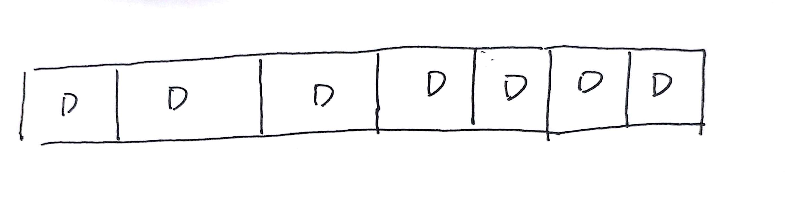
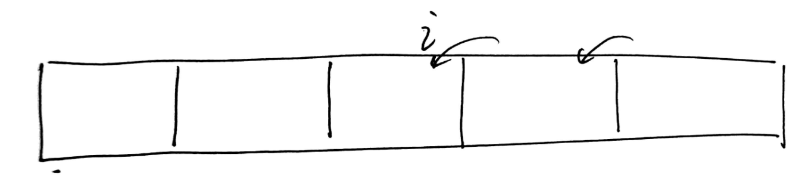
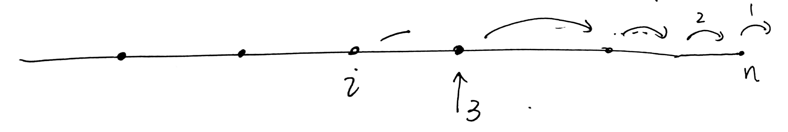
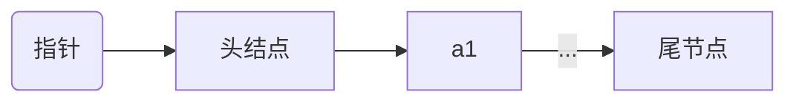

# 线性表

线性表是 n (≥0) 个数据元素的有限线性序列，记作$(a_1,a_2,a_3,...,a_n)$,$a_i$是数据元素，n表示长度

分类：

存储方式：

* 线性表：数组
* 链表：节点

性质：

* 除第一个元素外，其他每一个元素有一个且仅有一个直接前驱
* 除最后一个元素外，其他每一个元素有一个且仅有一个直接后继

线性表的$ADT$,[什么是ADT](https://baike.baidu.com/item/ADT/18299805)

```cpp
ADT LinearList{
    数据: n(>=0)个原子表项的一个有限序列;
    函数：
        查找（）
        添加（）
        求长度（）
        求空间（）
        插入数据（）
        修改数据（）
        ....
}
```

存取结构:

* 顺序存取，时间性能是$O(n)$
* 随机存取, 时间性能是$O(1)$

## 顺序表

<font color='red'>顺序表是线性表的一种储存方式</font>，这是一种储存方式！！！！

他是以随机存取为主要的存取方式，他的时间性能为$O(1)$,由于没有指针域的存在，他的空间效率相对于链式存储的方式使用效率更高，下图是他的空间结构



作为线性表的子类，他相对于线性表来说更加的具体，线性表的作为基类没有具体函数的实现，甚至没有数据成员，但是顺序表除了基类的功能之外还有以下的一些新：

* 该类所包含的数据`data`
* 数据成员的最大空间`maxSize`
* 现在已有的数据的大小，列表的长度`n`


```cpp
template<class T>
class SeqList:public LinearList<T>{
protected:
	T * data;  //顺序储存控制的数据列表
	int maxSize;   //该表的容量
	int n;    //该表已有的数据大小

	//两种排序方式
	void ReverseSort();	
	void ForwardSort();
public:
	SeqList(int sz=defaultSize); //构造函数
	SeqList(T a[],int i);
	~SeqList(); //析构函数
	int Size()const;
	int Length()const;
	int Search(T x)const;
	bool Insert(int i,T x);
	bool Remove (int i,T &x);   //删除并且返回删除的数据
	void Output();
	void Sort(int m); //实现正序，逆序的排列
	LinearList<T>operator=(LinearList<T> &L);
};
```

### 功能实现

#### 析构函数(`~SeqList()`)

对于顺序表而言，他所要实现的析构函数，只需要直接使用`delete` data数组，不需要像链式储存一样一个个释放空间，相对而言较为简单

```cpp
delete []data;
```

### 构造函数(`SeqList()`)

#### 无参构造

构造函数在这个里面相对是比较简单的，因为它主要负责申请空间，所以一般不需要传递参数给它，只需要像在函数体内`new`maxSize的大小给data即可

```cpp
data= new T[sz];
```

#### 有参构造

当然，如果需要实现在创建的时候初始化顺序表，那么，可以如下传入一个数组，然后逐一进行复制

```cpp
data = new T[i]
    this->maxSize=i;	//指定列表的容量
this->n=0;
for(int j=0;j<sizeof(a)/sizeof(a[0]),j++)
{
    data[j]=a[j]  //实现传入一个列表作为初始的数据
        this->n++;
}
```

#### Remove函数

remove函数的思想就是，在原来的i位置的基础，全部往前移动一位，那么程序可以像下面这样



```cpp
for(int j=i;j<n-1;j++)
{
    data[j]=data[j+1]
}
n--; //整个的数量减少
```

#### Insert函数

如果要实现在i位置的后方插入一个数，<font color='red'>那么必须从后面往前面插入</font>，绝对不要从i->n,所以整个程序的的图形解释为



```cpp
for(int j = n;j>i；j--)
{
    data[j]=data[j-1];	//最后一次为j=i+1,data[i]->data[i+1]
}
data[i]=x;				//将data[i]换成我们希望替换的值
this->n++;
return true;
```

## 链表

* 带头节点，第一个的数据域为空



单链表在实现的功能其实和之前的线性表差不多，因为他们的结果是一致的，只是使用的储存方式存在差异，所以，单链表的实现主要是注重链表的数据储存方式