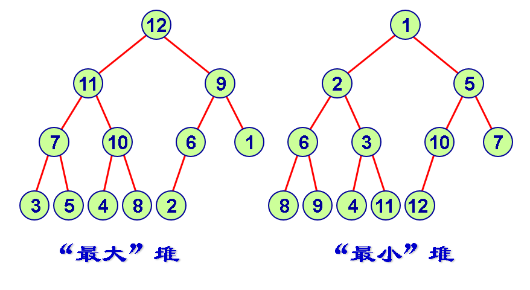
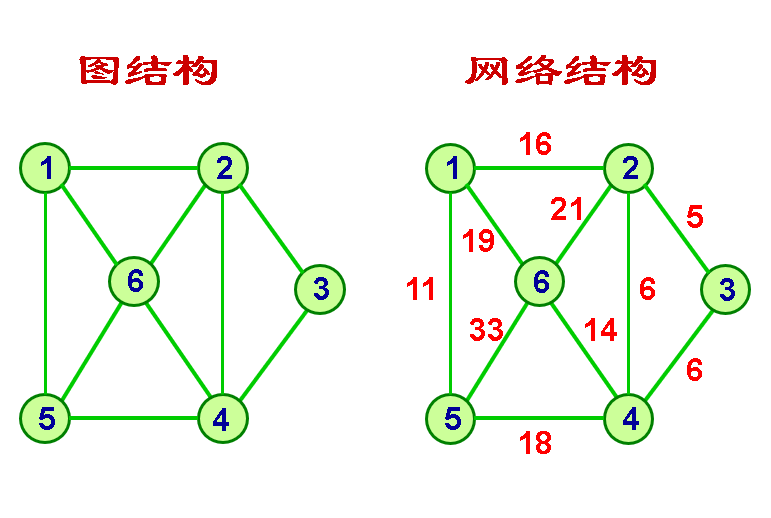
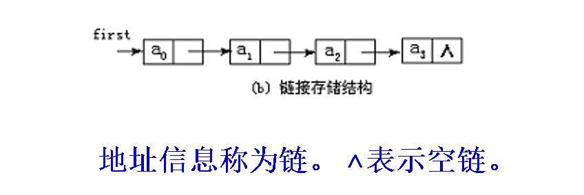

# 数据结构

## 数据之间的逻辑结构

* 集合结构

* 线性结构

  * 线性表

* 非线性结构

  * 树

    * 树

    * 二叉树

    * 二叉搜索树

    * [堆结构](https://www.jianshu.com/p/6b526aa481b1)

      

  * 图、网络

    

## 数据元素的储存形式

* 顺序存储

* 链接存储

  

* 索引存储

* 散列存储

## 数据的运算

* 创建
* 清除:删除数据结构中的全部元素
* 插入：**在数据结构的指定位置上插入一个新元素；**
* 删除运算:将数据结构中的某个元素删除

# 算法

对特定问题的描述步骤

## 算法的时间复杂度和空间复杂度

时间复杂度，大$O$标记法，常见的时间复杂度

